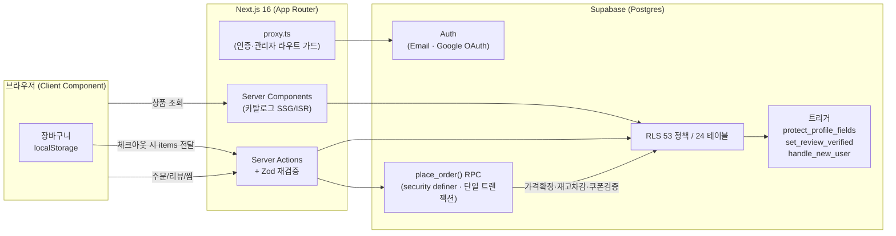

<div align="center">

# CHECK ⬦ MATE

**개인 큐레이션 주얼리 이커머스** — Firebase 정적 사이트를 **Next.js 16 + Supabase**로 전면 재설계한 풀스택 커머스


**📅 개발 기간: 2026.03 ~ 2026.05 · 개인 프로젝트**

</div>

---

## 🖥️ 데모

<!-- TODO: 메인 화면 / 상품상세 / 장바구니→주문 / 관리자 백오피스 GIF 또는 스크린샷을 여기에 배치 -->

| 화면 | 미리보기 |
|---|---|
| 고객 — 홈/카탈로그 | 🚧 `<!-- TODO: screenshot -->` |
| 고객 — 상품상세 → 장바구니 → 주문 | 🚧 `<!-- TODO: GIF -->` |
| 관리자 — 백오피스 | 🚧 `<!-- TODO: screenshot -->` |

**🔗 배포 링크:** `<!-- TODO: Vercel 배포 URL (미배포 시 이 줄 삭제) -->`

> 로컬 실행은 [로컬 실행](#-로컬-실행) 참고.

---

## 🎯 만든 이유 (문제 정의)

기존 사이트는 **Firebase 기반 정적 구조**여서, **가격·재고·쿠폰 같은 거래의 핵심 값을 클라이언트가 다뤘습니다.** 이커머스에서 이 구조는 치명적입니다 — 브라우저에서 결제 금액을 조작하거나, 동시 주문으로 재고를 음수로 만들거나, 사지 않은 상품에 "구매 인증" 리뷰를 위조할 여지가 있습니다.

이 프로젝트의 목표는 한 문장입니다: **"돈과 권한에 관한 모든 판단을 클라이언트에서 떼어내 서버(DB)로 옮긴다."**
그래서 가격·재고·쿠폰은 **DB에서 확정**하고, 접근 제어는 **Postgres RLS + 트리거**가 강제합니다. 애플리케이션 코드가 버그를 내도 DB 계층이 마지막 방어선이 되도록 설계했습니다.

---

## 🧰 기술 스택 + 선정 이유

| 분류 | 기술 | 왜 이걸 선택했나 |
|---|---|---|
| 프레임워크 | **Next.js 16** (App Router, RSC) | Server Component로 DB 조회를 서버에서 수행 → 민감 로직·키를 클라이언트에 노출하지 않음. SSG/ISR로 카탈로그는 정적 캐싱 |
| 백엔드 | **Supabase** (Postgres·Auth·RLS·RPC) | 별도 백엔드 서버 없이 **RLS·트리거·RPC로 신뢰 경계를 DB에 둘 수 있음** — 이 프로젝트의 핵심 목표와 정확히 맞음 |
| 언어 | **TypeScript (strict)** | DB 타입을 `Database` 타입으로 끌어와 쿼리~컴포넌트까지 타입 안전성 확보 |
| 폼/검증 | **Server Actions + Zod** | 클라이언트 검증을 신뢰하지 않고 서버에서 재검증. `useActionState`/`useTransition`로 UX 처리 |
| 스타일 | **Tailwind v4 + shadcn/ui** | 디자인 토큰 일관성. Pretendard(본문)/Cormorant Garamond(디스플레이)로 럭셔리 톤 |
| 상태/데이터 | **TanStack Query** | 관리자 화면의 서버 상태 캐싱·갱신 |
| 테스트/CI | **Playwright · GitHub Actions** | E2E로 핵심 플로우 회귀 방지, push마다 typecheck+lint |

---

## 🏗️ 시스템 아키텍처



**상품 → 장바구니 → 주문 흐름:** 카탈로그는 RSC로 정적 렌더 → 장바구니는 localStorage(비로그인도 담기 가능) → 체크아웃 시 cart items를 Server Action에 넘기면 **`place_order` RPC가 가격·재고·쿠폰을 DB에서 다시 확정**하고 주문을 생성(`pending`). 클라이언트가 보낸 금액은 신뢰하지 않습니다.

---

## ✅ 주요 기능 현황

| 영역 | 기능 | 상태 |
|---|---|---|
| 🛍️ 카탈로그 | 카테고리·상품상세·컬렉션, 옵션, SSG/ISR, SEO(JSON-LD·sitemap·robots) | ✅ |
| 🔐 인증 | 이메일+비밀번호 / Google OAuth, 라우트 가드(`proxy.ts`) | ✅ |
| 🛒 주문 | 장바구니(localStorage) → 주문서 → **원자적 `place_order` RPC** | ✅ |
| 👤 마이페이지 | 대시보드·주문내역·**구매인증 리뷰**·쿠폰·찜 | ✅ |
| 🧑‍💼 관리자 | 상품·옵션·주문·회원·쿠폰·FAQ 관리, 역할 기반 접근 제어 | ✅ |
| 🚚 배송 | 주문 상태(pending→paid→…→delivered), 운송장 입력 | ✅ |
| 🎨 디자인 | 스크롤 reveal·진행률 바·포인터 틸트·glass/gold (CSS + IntersectionObserver) | ✅ |
| 💳 결제(PG) | **실 PG 미연동** — 결제수단(무통장/카드)은 폼 선택값만, 주문은 `pending` 상태로 생성 | 📋 계획 |
| 🖼️ 이미지 업로드 | 상품 이미지는 URL 배열로 저장(시드). Supabase Storage 공개 버킷 서빙은 `next.config`에 설정 | 📋 업로드 UI 미구현 |

---

## 🔧 트러블슈팅 / 핵심 의사결정

**1) 주문 금액 위변조 — 신뢰 경계를 어디에 둘 것인가**
- **문제:** 기존 구조는 가격·할인 계산을 클라이언트가 수행 → 결제 금액 조작 가능.
- **원인:** 거래의 "정답"이 신뢰할 수 없는 클라이언트에 있었음.
- **해결:** 주문 생성을 **`place_order` RPC(security definer) 한 곳**으로 모아 가격·쿠폰을 DB에서 재계산. 클라 값은 무시.
- **결과:** 클라이언트가 어떤 금액을 보내도 최종 결제액은 DB가 확정. 애플리케이션 버그가 금액 조작으로 이어지지 않음.

**2) 동시 주문 시 재고 음수 / 쿠폰 중복 사용**
- **문제:** 주문이 몰리면 race condition으로 재고가 음수가 되거나 쿠폰이 중복 사용됨.
- **원인:** 재고 확인과 차감 사이의 시간 틈(check-then-act).
- **해결:** RPC 내부에서 `SELECT ... FOR UPDATE` **행잠금 + 단일 트랜잭션**으로 재고 차감·쿠폰 사용 처리, 부족 시 `raise exception`으로 **전체 롤백**.
- **결과:** 동시 요청에서도 재고/쿠폰 정합성 보장 (부분 커밋 불가능).

<details>
<summary>3) 권한·리뷰 위조 — 코드가 아닌 DB가 강제하게 (펼치기)</summary>

- **문제:** 일반 유저가 자기 `role`/등급/포인트를 바꾸거나, 구매하지 않은 상품에 "구매 인증" 리뷰를 다는 위조.
- **원인:** 권한 검증을 애플리케이션 코드에만 의존하면, 코드 경로 하나만 빠뜨려도 뚫림.
- **해결:** **RLS 53개 정책(24개 테이블)** + 트리거 — `protect_profile_fields`(권한 필드 변경 차단), `set_review_verified`(주문 이력 기반으로 `verified` 강제 설정), `handle_new_user`(가입 시 프로필 자동 생성). Server Action도 `getAdmin()`으로 재검증.
- **결과:** 클라이언트·Server Action·DB 3중 방어. 일반 유저는 SQL을 직접 던져도 권한 필드를 못 바꿈.
</details>

---

## 🚀 로컬 실행

> 모든 개발은 `web/` 디렉토리에서 진행합니다.

```bash
git clone https://github.com/SkyWith628/checkmate.git
cd checkmate/web
npm install

# 1) 환경변수
cp .env.local.example .env.local
# .env.local 을 아래 값으로 채웁니다 (Supabase 대시보드 → Settings → API):
#   NEXT_PUBLIC_SUPABASE_URL=https://<project-ref>.supabase.co
#   NEXT_PUBLIC_SUPABASE_ANON_KEY=<anon key>
#   SUPABASE_SERVICE_ROLE_KEY=<service role key>   # 서버 전용, 절대 클라 노출 금지
#   NEXT_PUBLIC_SITE_URL=http://localhost:3000

# 2) DB 스키마 적용
#   web/supabase/migrations/*.sql 을 순서대로
#   Supabase 대시보드 SQL Editor에 붙여 실행 (또는 supabase/APPLY_ALL.sql 한 번에)

# 3) 테스트 상품 시드 (선택)
node --env-file=.env.local scripts/seed-products.mjs

# 4) 관리자 계정 생성 (선택)
node --env-file=.env.local scripts/create-admin.mjs <email> <password> [name]

# 5) 개발 서버
npm run dev          # http://localhost:3000
```

| 명령 | 설명 |
|---|---|
| `npm run dev` | 개발 서버 |
| `npm run build` | 프로덕션 빌드 |
| `npm run typecheck` | `tsc --noEmit` |
| `npm run lint` | eslint |
| `npm run test:e2e` | Playwright E2E (dev 서버 자동 기동) |

승격된 관리자 계정으로 로그인하면 우상단 사용자 메뉴에 **관리자 페이지(`/admin`)** 가 나타납니다.

---

## 📁 구조 (요약)

```
checkmate/
├─ web/                       # 앱 (Next.js 16 + Supabase)
│  ├─ src/app/                # App Router — (shop) / (auth) / admin
│  ├─ src/components/         # shop · admin · auth · ui
│  ├─ src/lib/                # actions · queries · supabase 클라 4종 · types · validations
│  ├─ src/proxy.ts            # Next 16 미들웨어(인증·관리자 라우트 가드)
│  ├─ supabase/migrations/    # 스키마 · RLS · RPC · 트리거 SQL
│  ├─ scripts/                # seed-products.mjs · create-admin.mjs
│  └─ e2e/                    # Playwright (auth · catalog · admin)
└─ docs/ARCHITECTURE.md       # 설계 단일 소스(스키마·RLS·RPC·로드맵)
```

---

## 💭 회고

가장 크게 배운 것은 **"신뢰 경계(trust boundary)를 코드가 아니라 데이터 계층에 두는 것"** 의 가치입니다. 처음에는 Server Action에서 권한·금액을 검증하면 충분하다고 생각했지만, RLS와 트리거로 DB 자체가 규칙을 강제하게 만들자 "어느 코드 경로로 들어와도 안전하다"는 확신이 생겼습니다. 다음 단계는 실 PG(결제 게이트웨이) 연동과 이미지 업로드 UI입니다.

---

<div align="center">
<sub>개인 학습/포트폴리오 프로젝트 · Next.js 16 + Supabase 풀스택</sub>
</div>
